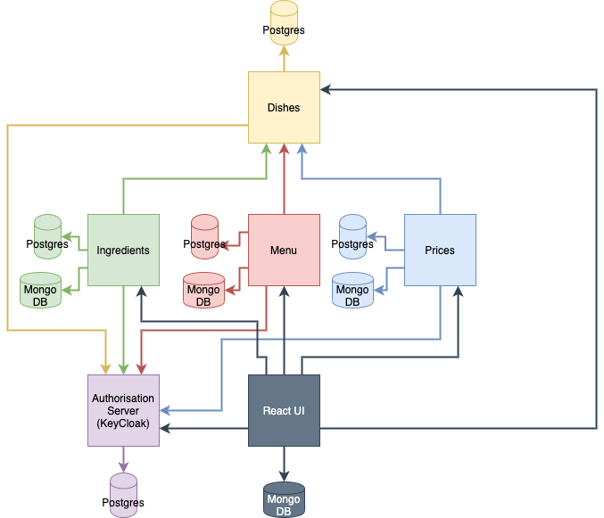

# Microservice Test Project
This is my microservice test project. I will play here when I want to learn something related to the microservices using Spring Boot. My goal is not to build the "perfect" microservice architecture, but to become familiar with the concepts, libraries, frameworks and other things related to the microservices.

### Requirements
* JDK 11
* Docker
* Docker compose

~~~~
# To run the docker container
$ docker-compose -f ${/path/to/the/project}/misc/Docker/docker-compose-db-and-keycloak.yml up
~~~~

### Initial configuration
Once you have started the docker containers, you have to perform some initial steps to configure Keycloak:

* Connect to the Docker container that is running the Keycloak server and import the initial realm
~~~~
# Retriever the container ID
$ docker ps

# SSH into the container
$ docker exec -it <containerID> /bin/bash

# Run the following command inside the container
$ /opt/jboss/keycloak/bin/standalone.sh -Dkeycloak.profile.feature.upload_scripts=enabled -Djboss.socket.binding.port-offset=100 -Dkeycloak.migration.action=import -Dkeycloak.migration.provider=singleFile -Dkeycloak.migration.file=realm-export.json -Dkeycloak.migration.strategy=OVERWRITE_EXISTING

# Once the import is complete press CTRL + c to quit jboss
# Press one more time CTRL + c to leave the container
# Now restart the container
~~~~

* [Login in into KeyCloak](http://localhost:8091) with:
  * Username: admin
  * Password: password
  
  You have to generete the client secrets and update the configuration of the services

### Architecture

Current list of implemented things:

* Postman HTTP Requests 
* [Discovery Service](http://localhost:8761/) 
* Postgres SQL running in a docker container
* MongoDB running in a docker container
* Keycloak running in a docker container
* Configuration Service
  * Encrypted properties
  * [Properties per profiles](http://localhost:8888/marco-react-ui/default)
* Dishes Service
  * [Swagger documentation](http://localhost:8081/dishes/swagger-ui.html)
  * Unit Tests
  * SQL init scripts
  * Multi language support (ITA, ENG)
* Ingredients Service
  * [Swagger documentation](http://localhost:8082/ingredients/swagger-ui.html)
  * Unit Tests
  * SQL init scripts
  * Multi language support (ITA, ENG)
* Prices Service
  * [Swagger documentation](http://localhost:8083/prices/swagger-ui.html)
  * Unit Tests
  * SQL init scripts
  * Multi language support (ITA, ENG)
* Menu Service
  * [Swagger documentation](http://localhost:8084/menus/swagger-ui.html)
  * Unit Tests
  * SQL init scripts
  * Multi language support (ITA, ENG)
* [Security System](http://localhost:8091/auth/)
  * Keycloak - I am using Keycloak to manage users authentication and authorisation. I used the following tutorials:
    * [Keycloak - what it is](https://www.youtube.com/watch?v=KrOd5wIkqls)
    * [Keycloak Realm - Users Config](https://www.thomasvitale.com/keycloak-configuration-authentication-authorisation/)
    * [Keycloak Single Sign On SSO - Client Config](https://www.thomasvitale.com/keycloak-authentication-flow-sso-client/)
    * [Spring security with Keycloak](https://www.thomasvitale.com/spring-security-keycloak/)
* Oauth2 + Open Id Connect
* [React UI](http://localhost:8086/reactui/): This service provides the UI to mange the information stored in the other micro services. It has a very basic UI, just to play around with React JS, I don't plan to manage all the possible scenarios.

### Todo
These are the things that I plan to add when I have time:

* Integration Tests
* Fault tollerance
* Resilience
* Move the hard coded configuration in a DB
* ... anything else that it will come up in my mind :)
