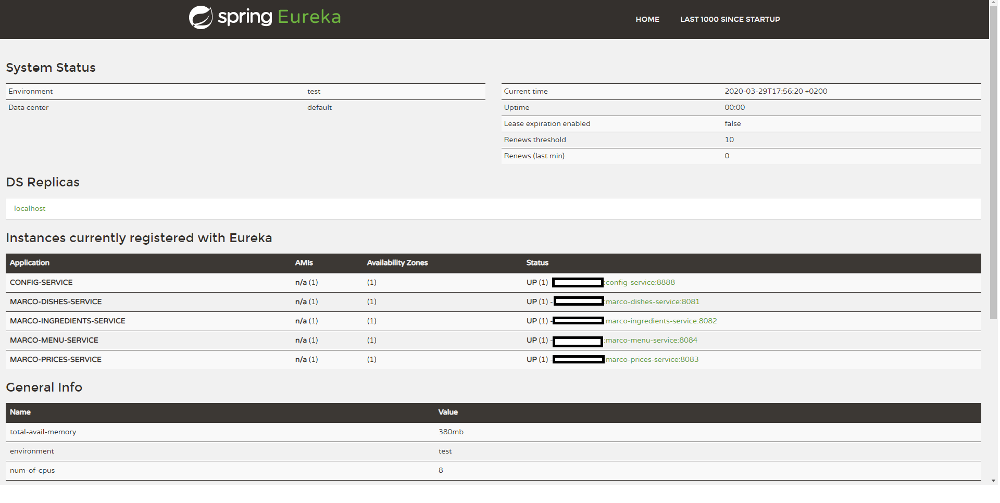

# Microservice Test Project
This is my microservice test project. I will play here when I want to learn something related to the microservices using Spring Boot. My goal is not to build the "perfect" microservice architecture, but to become familiar with the concepts, libraries, frameworks and other things related to the microservices.

### Requirements
* JDK 8
* PostgresSQL server
* Docker
* Docker compose

~~~~
# To run the docker container
$ docker-compose -f /path/to/the/project/misc/Docker/docker-compose-db-and-keycloak.yml up
~~~~

### Architecture

Current list of implemented things:

* Postman HTTP Requests 
* Discovery Service 
* Postgres SQL running in a docker container
* MongoDB running in a docker container
* Keycloak running in a docker container
* Configuration Service
* 

  * Encrypted properties
  * Properties per profiles
* Dishes Service

  * Swagger documentation
  * Unit Tests
  * SQL init scripts
  * Multi language support
* Ingredients Service

  * Swagger documentation
  * Unit Tests
  * SQL init scripts
  * Multi language support
* Prices Service

  * Swagger documentation
  * Unit Tests
  * SQL init scripts
  * Multi language support
* Menu Service

  * Swagger documentation
  * Unit Tests
  * SQL init scripts
  * Multi language support

### Todo
These are the things that I plan to add when I have time:

* Integration Tests
* Fault tollerance
* Resilience
* UI
* Use Java 11 (or higher)
* Spring Security
* Oauth
* ... anything else that it will come up in my mind :)
